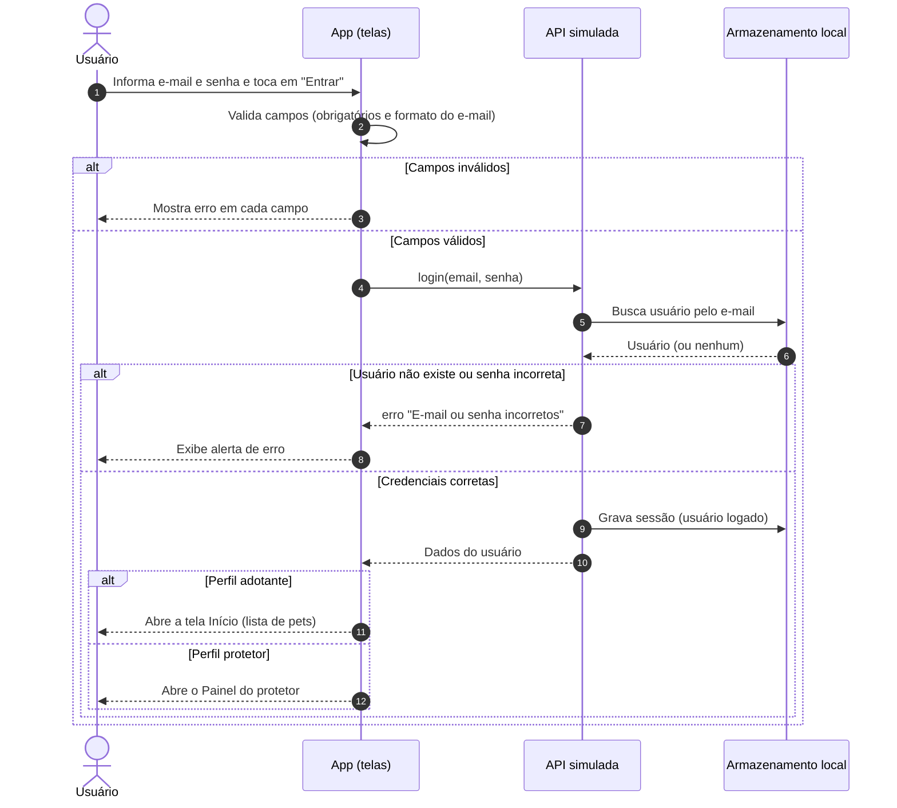
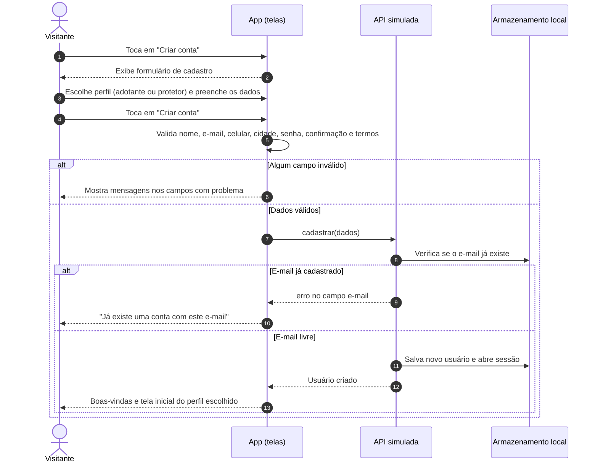
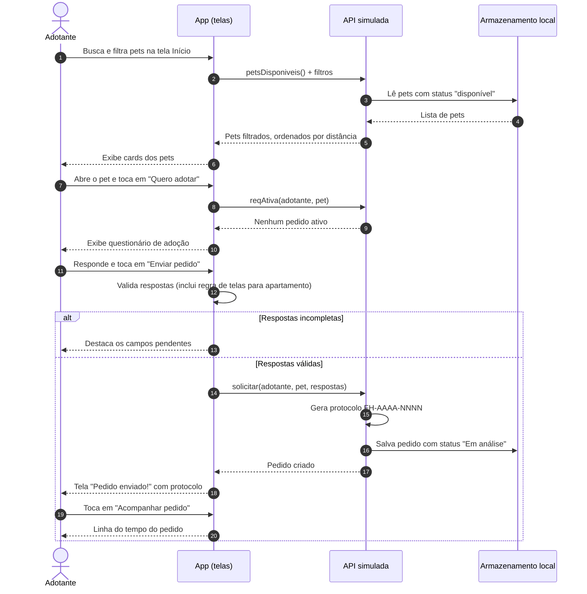
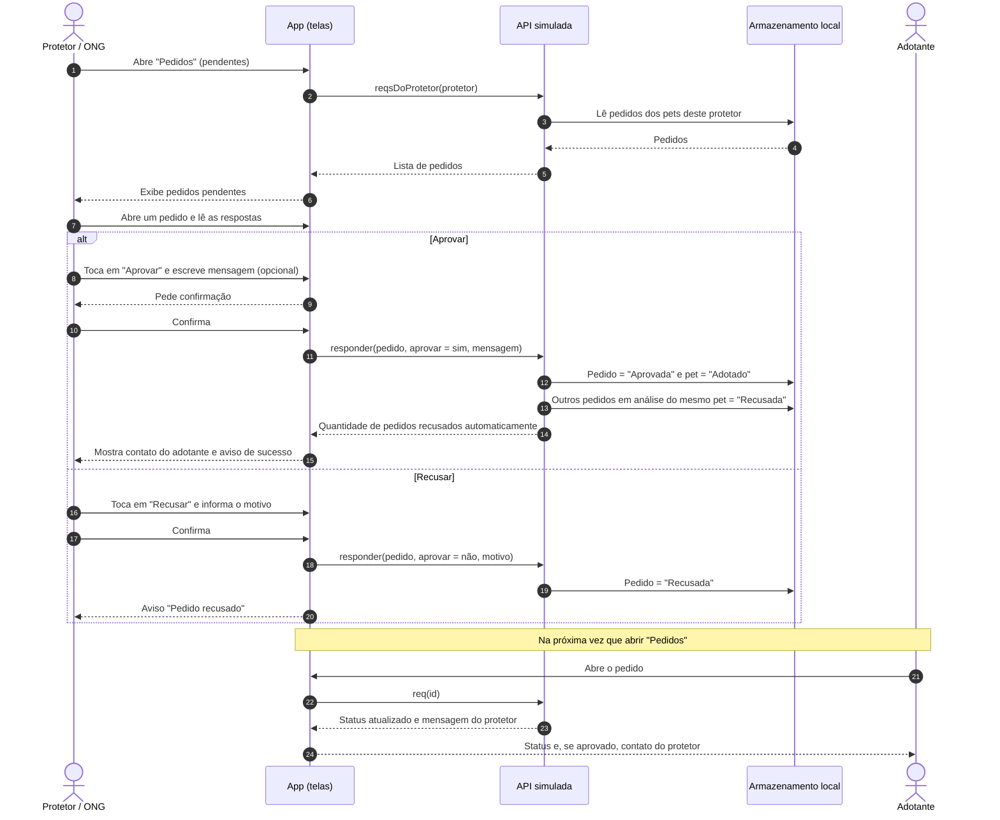
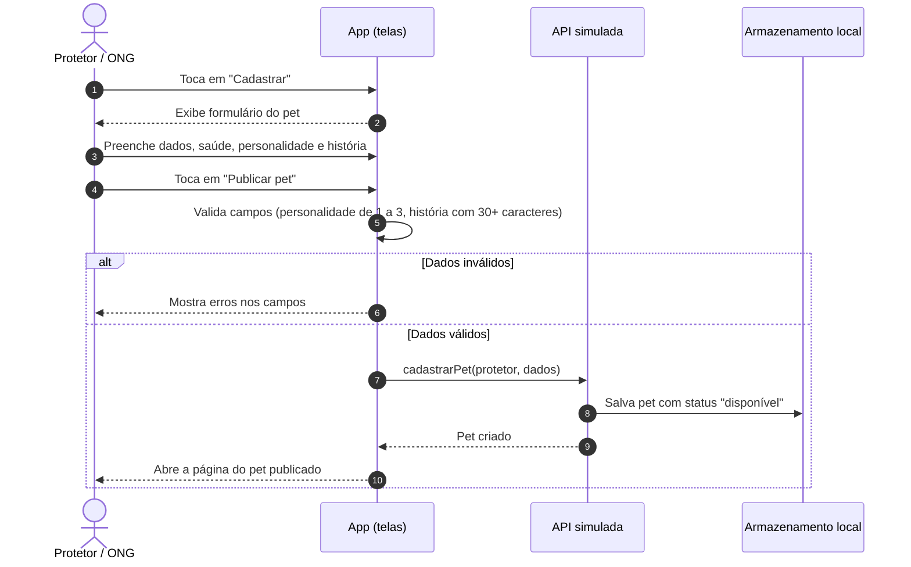
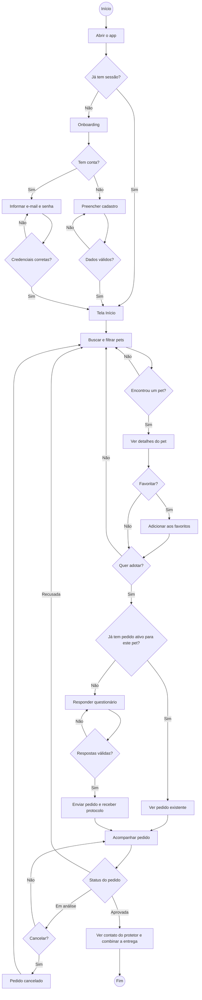
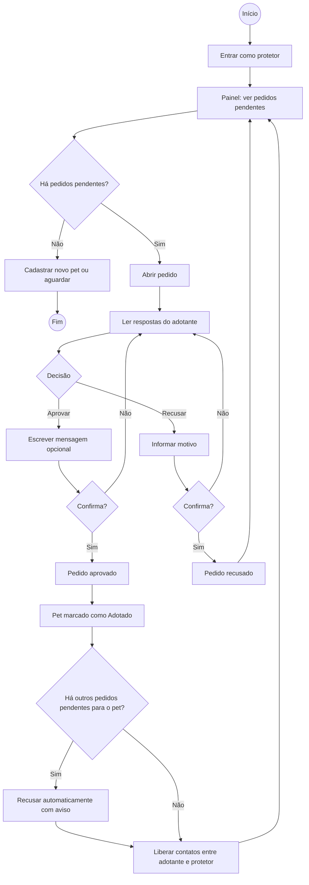
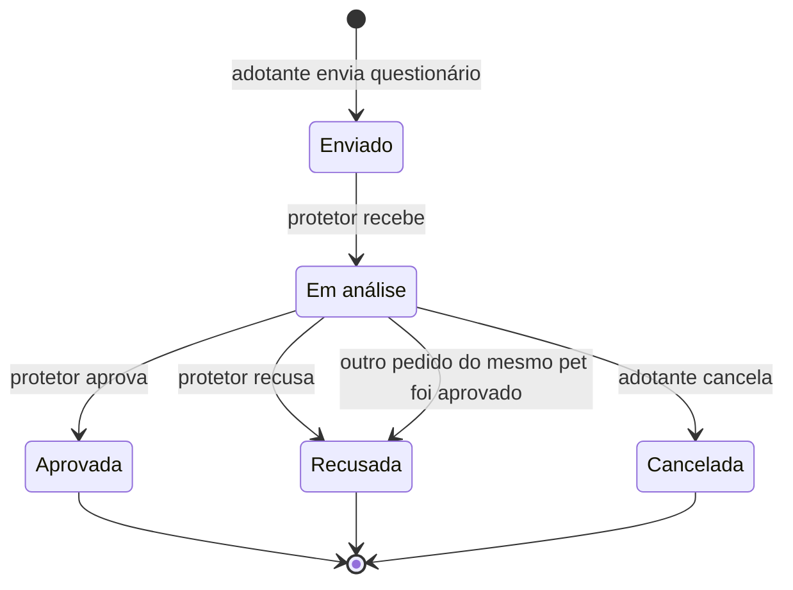

# FindHome Pets — Diagramas

Diagramas atualizados de acordo com os **fluxos simulados no protótipo**.
Os diagramas estão em [Mermaid](https://mermaid.js.org/) e são renderizados automaticamente pelo GitHub. Versões em imagem (PNG e SVG) de cada um estão em [`docs/img/`](img/), prontas para slides ou relatório.

**Participantes usados nos diagramas de sequência**

| Participante | No protótipo |
|---|---|
| Adotante / Protetor | Pessoa usando o app |
| App (telas) | Telas e formulários (`SCREENS`, `FORMS`) |
| API simulada | Regras de negócio que, na versão final, ficarão no servidor (objeto `API`) |
| Armazenamento local | `localStorage` do navegador, no lugar do banco de dados |

---

## 1. Diagramas de sequência

### 1.1 Login

### 1.2 Cadastro de conta

### 1.3 Solicitar adoção (fluxo principal do adotante)

### 1.4 Avaliar pedido (fluxo principal do protetor)

### 1.5 Cadastrar pet (protetor)

---

## 2. Diagramas de atividade

### 2.1 Jornada do adotante: da entrada à adoção

### 2.2 Avaliação de pedido pelo protetor

### 2.3 Ciclo de vida do pedido de adoção

